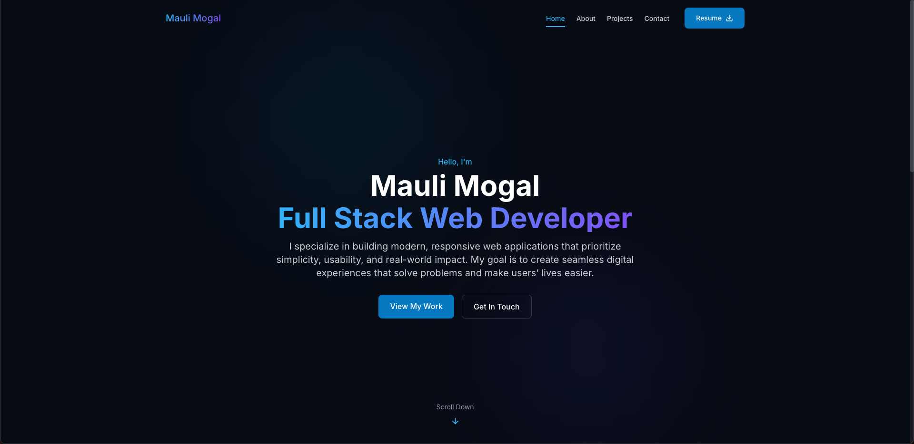

# 🌐 Mauli Mogal — Developer Portfolio

Welcome to my personal portfolio website!  
Built with **Vite + React**, this project showcases my skills, experience, and projects as a Full Stack Developer. It's fast, responsive, and designed to deliver a clean user experience.

---

## 🛠 Tech Stack

- **Frontend:** React, TypeScript, Tailwind CSS  
- **Build Tool:** Vite  
- **Deployment:** Vercel  

---

## 🚀 Live Demo

🔗 [Visit the Live Site](https://www.maulimogal.com)

---

## 📸 Preview

  

---

## 📁 Project Structure

```bash
├── public/                # Static files (favicon, robots.txt, etc.)
├── src/
│   ├── assets/            # Images and media
│   ├── components/        # Reusable UI components
│   ├── pages/             # Page sections (About, Projects, etc.)
│   ├── App.tsx            # Main app container
│   └── main.tsx           # Entry point for Vite
├── index.html             # HTML template
├── tailwind.config.js     # Tailwind CSS configuration
├── postcss.config.js      # PostCSS setup
├── vite.config.ts         # Vite configuration
└── README.md              # You’re here!
```

---

## ✨ Features

- ✅ **Responsive Design** — Looks great on mobile, tablet, and desktop.  
- ⚡ **Fast Performance** — Built with Vite for ultra-fast loading.  
- 🎨 **Modern UI** — Clean, minimalist design using Tailwind CSS.  
- 🧠 **Project Showcases** — Highlight real-world apps and case studies.  
- 👤 **About Section** — Personal introduction and developer photo.  
- 📫 **Contact Form** — Easy way for visitors to get in touch.  

---

## 🧑‍💻 Getting Started

Clone the repository and set up the project locally:

```bash
# Clone the repo
git clone https://github.com/maulimogal/portfolio.git

# Navigate into the project folder
cd portfolio

# Install dependencies
npm install

# Start development server
npm run dev
```

Now open [http://localhost:5173](http://localhost:5173) in your browser to view the app.

---

## 📦 Build for Production

To generate a production-ready build:

```bash
npm run build
```

This creates a `dist/` folder with optimized files, ready to deploy.

---

## 🧠 About Me

Hi, I’m **Mauli Mogal** — a passionate Full Stack Web Developer from India.  
I love building modern, scalable, and user-focused web applications that solve real-world problems.

This portfolio is a reflection of my journey, skills, and the work I’ve done so far. I enjoy writing clean code, learning new tech, and collaborating on impactful projects.

---

## 📬 Contact

Want to collaborate or just say hi?  
Feel free to connect through any of the channels below:

- 🌐 Website: [www.maulimogal.com](https://www.maulimogal.com)  
- 📧 Email: [maulimogal@gmail.com](mailto:maulimogal@gmail.com)  
- 💼 LinkedIn: [linkedin.com/in/maulimogal](https://linkedin.com/in/maulimogal)  
- 🐙 GitHub: [github.com/maulimogal](https://github.com/maulimogal)  

---

## 🔖 License

This project is licensed under the **MIT License**.  
You are free to use, modify, and distribute it with attribution.

---

**Designed and developed by Mauli Mogal — 2025**  
_Made with ❤️ using Vite + React + Tailwind CSS_